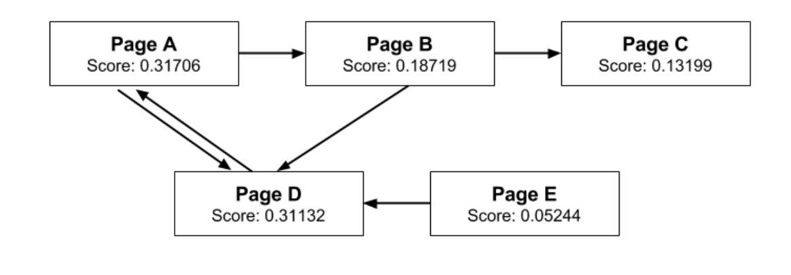
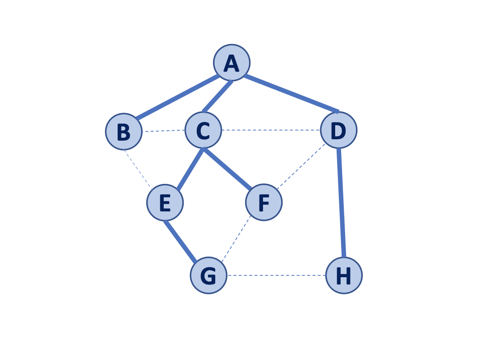

Video: https://youtu.be/_XWeqYf0kL0
# shouria2-shengya4-shengqi5-hyt2
Final project for CS 225 

# Introduction

For our CS 225 Final Project, our group decided to implement the BFS Traversal, Dijkstra's Shortest Path Algorithm, 
and the PageRank algorithm primarily used by Google for updating probabilities of website traffic. Described below
are the Usage and specifications of our project. 

## Usage

To the test cases, execute the following commands:

```
cd shouria2-shengya4-shengqi5-hyt2

make test

./test - runs all test cases
./test "selected test case" - runs selected test case

```

To run the program generate_graph, execute the command with the following command-line arguments:


```
cd shouria2-shengya4-shengqi5-hyt2

make

./generate_graph [arg1] [arg2] [arg3] [arg4] [arg5]

*arg1: TRUE or FALSE representing whether to load an entire dataset for
PageRank. Use TRUE for smaller datasets. FALSE randomly loads a subset,
only use it if the dataset is very large!!

*arg2: the path to the dataset to run PageRank on

*arg3: the path to the dataset to run BFS traversal on

*arg4: the path to the dataset to run Dijkstra on

*arg5: the starting Vertex of the shortest path algorithm

Ex: ./generate_graph TRUE
     data/web-Google_copy.txt
     data/bfs_multiple_disc.txt 
     data/dijkstra_complex.txt
     Home
```

## Format of Datasets

**PageRank**

```
All vertices must either have at least 1 outgoing edge or at least 1
incoming edge; self loops are not supported. A vertex by itself represents a webpage that is
unreachable and it does not direct to anywhere else!!

example:   A B
           A D
           B C
           B D
           D A
           E D
           --- blank line at the end of the file NEEDED
```



**BFS**

```
If the data contains single Vertecies that have no edges, you need to input ?

disconnected single vertex example:
           Siebel ?
           ? Union
           ? CBTF
           --- blank line at the end of the file NEEDED

example:   A B
           A C
           A D
           B C
           C D
           B E
           C E
           C F
           D F
           D H
           H G
           F G
           E G
           --- blank line at the end of the file NEEDED
```




**Dijkstra's**
```
The data needs to have a list of edges with weights. We do not support self loops. Disconnected
components are ok but each connected component needs to have at least 2 vertices. A single vertex
with no weight does not make sense!!

example:   Home C 5
           Home B 2
           B E 6
           E C 2
           Home A 3
           A D 3
           D B 1
           D F 4
           F E 1
           E School 4
           F School 2
           --- blank line at the end of the file NEEDED
```


